[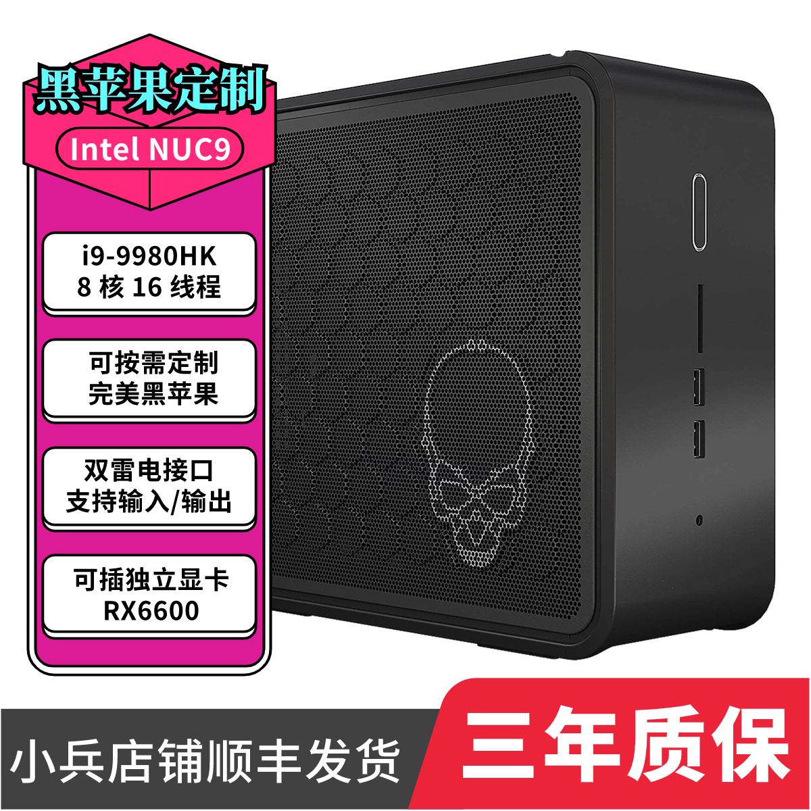](https://item.taobao.com/item.htm?id=732931461537)

## 电脑配置

|   规格    |                    详细信息                     |
| :-------: | :---------------------------------------------: |
| 电脑型号  | Intel NUC9 `NUC9i5QNX` `NUC9i7QNX` `NUC9i9QNX`  |
| 操作系统  |     macOS `Sonoma` / `Ventura` / `Monterey`     |
|  处理器   |    Intel `i5-9300` / `i7-9750` / `i9-9980HK`    |
|   内存    |             64 GB DDR4 2666-3200MHz             |
| 硬盘1/2/3 |              支持多至三个 m.2 NVMe              |
|   显卡    |            Intel UHD 630 / AMD 独显             |
| 显示接口  |        雷电3 x2 + HDMI 2.0a x1(4K@60Hz)         |
|   声卡    |                USB Audio Device                 |
| 无线网卡  | m.2 NGFF插槽，默认出厂为 `Intel® Wi-Fi 6 AX200` |
| 有线网卡  | Intel® Ethernet Connection`i219-LM` / `i210-AT` |
|  读卡器   |                      SDXC                       |

## 更新日志

- 11-23-2024
  - 更新 `OpenCore` `v1.0.2`
  - 更新 `I210` 驱动
  - `Sequoia` 请安装支持 `AX200` 的特别版本，[OCLP for Intel](https://pan.daliansky.net/d/APPS/OCLP/OpenCore-Patcher_v1.6.0_for_Intel.pkg)
  
- 3-12-2024
  - 更新 `OpenCore` `v0.9.9`
  - 更新 `I219-LM` 驱动
  - 更新 `IOSkywalkFamily.kext` 到 `v1.1.0`
  - `Sonoma` 如果想更新到 `14.4` 请务必先更新 `EFI` ，然后再安装 [OCLP](https://pan.daliansky.net/APPS/OCLP/OCLP.md)，重启后，再升级到 `14.4` 否则会出现 `WIFI` 无法启用的问题
- 9-22-2023
  - 更新 `OpenCore` `v0.9.5`
  - 支持 `Sonama` 安装使用
  - 适配 `BCM94360Z3`
- 8-11-2023
  - 更新 `OpenCore` `v0.9.4`
- 7-31-2023
  - 第一次提交

## 截屏

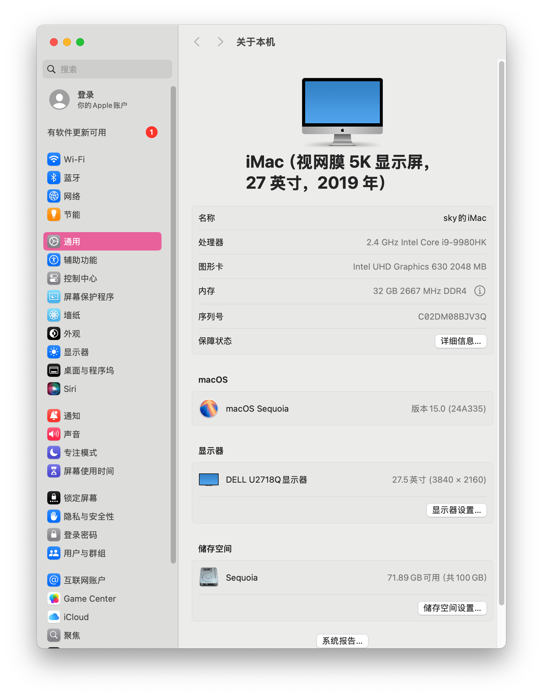

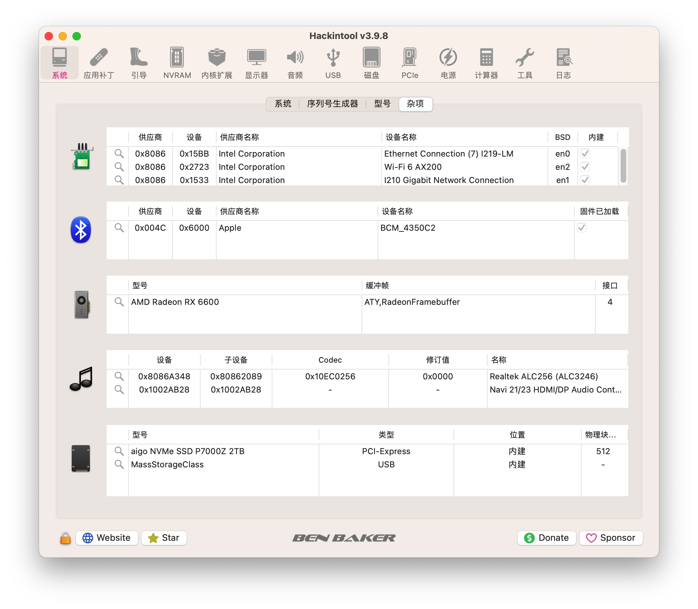

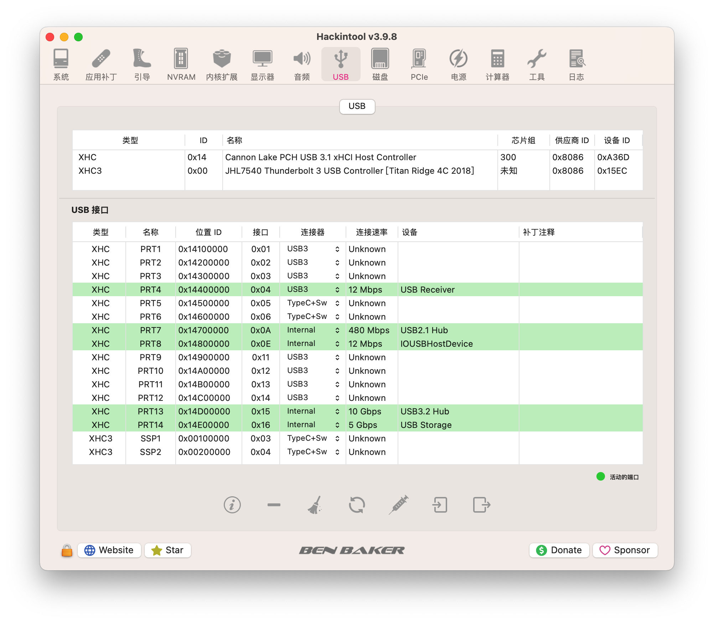

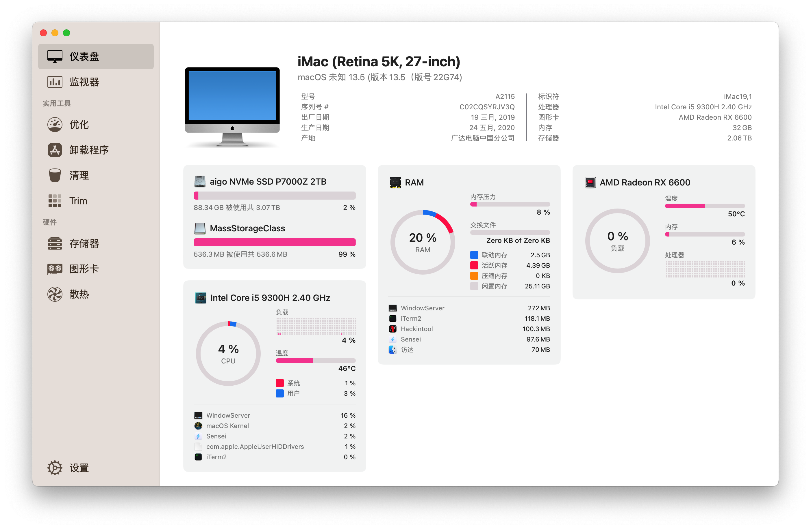

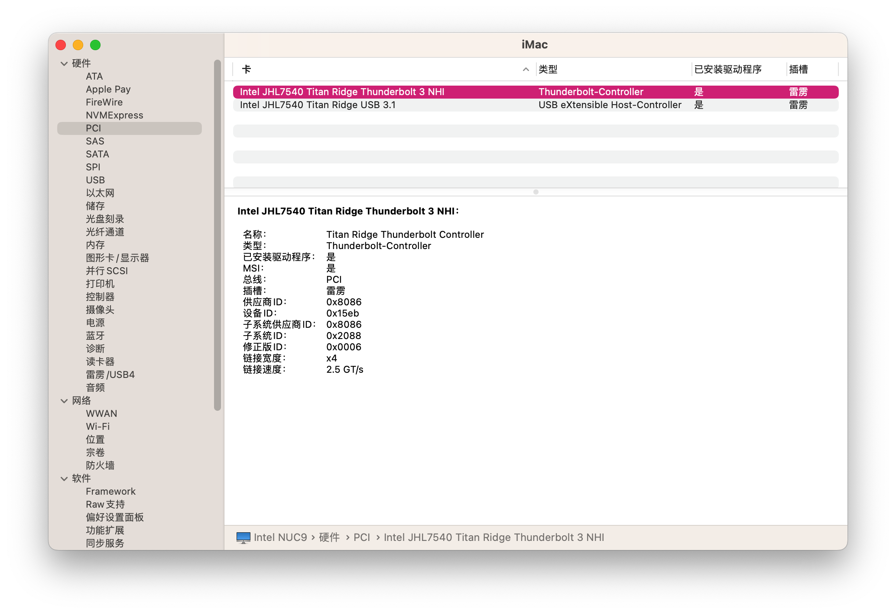

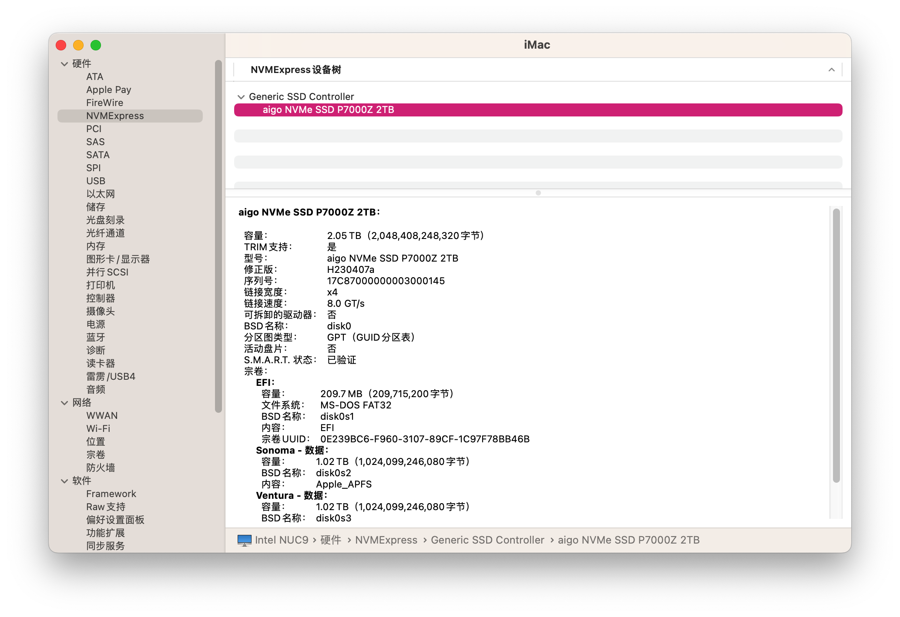

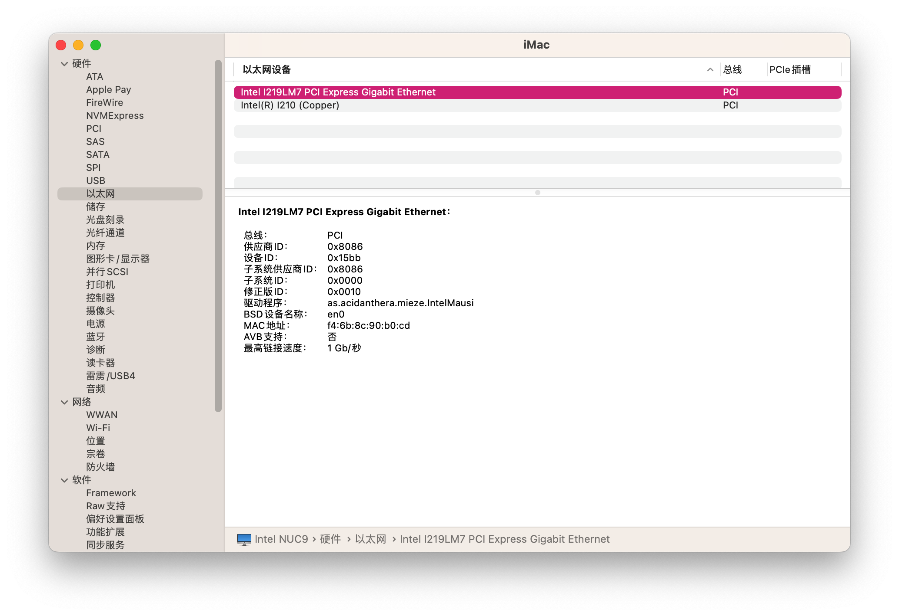

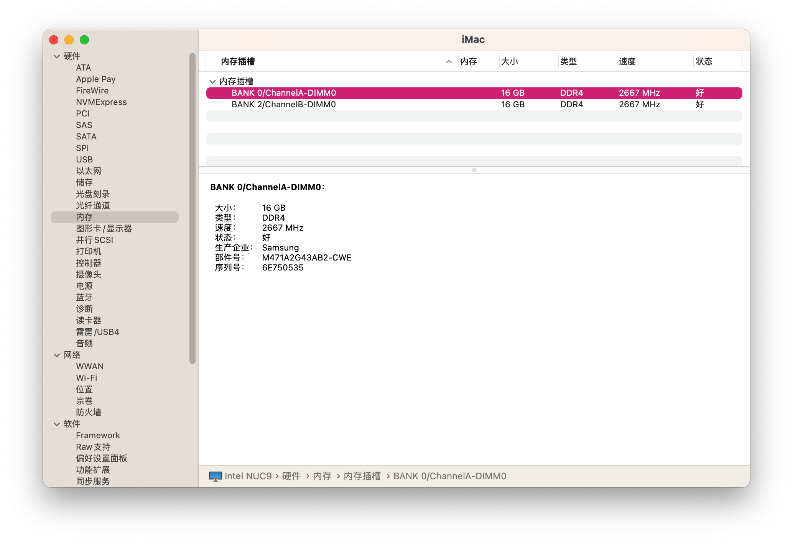

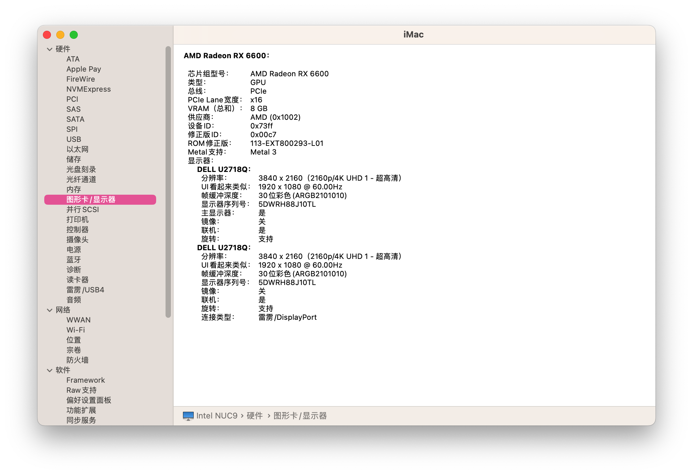

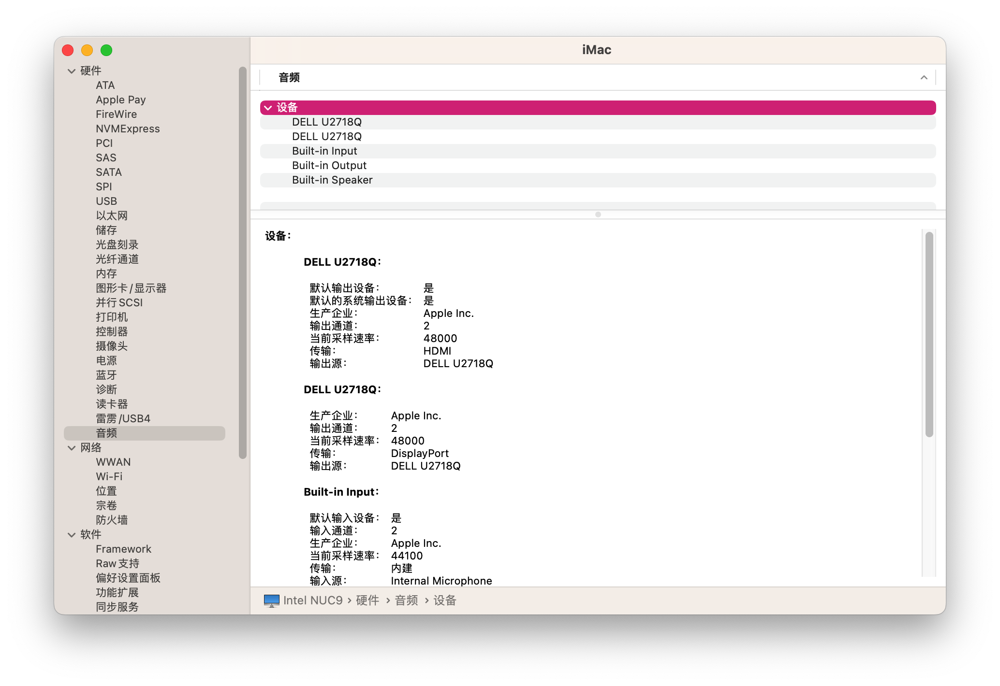

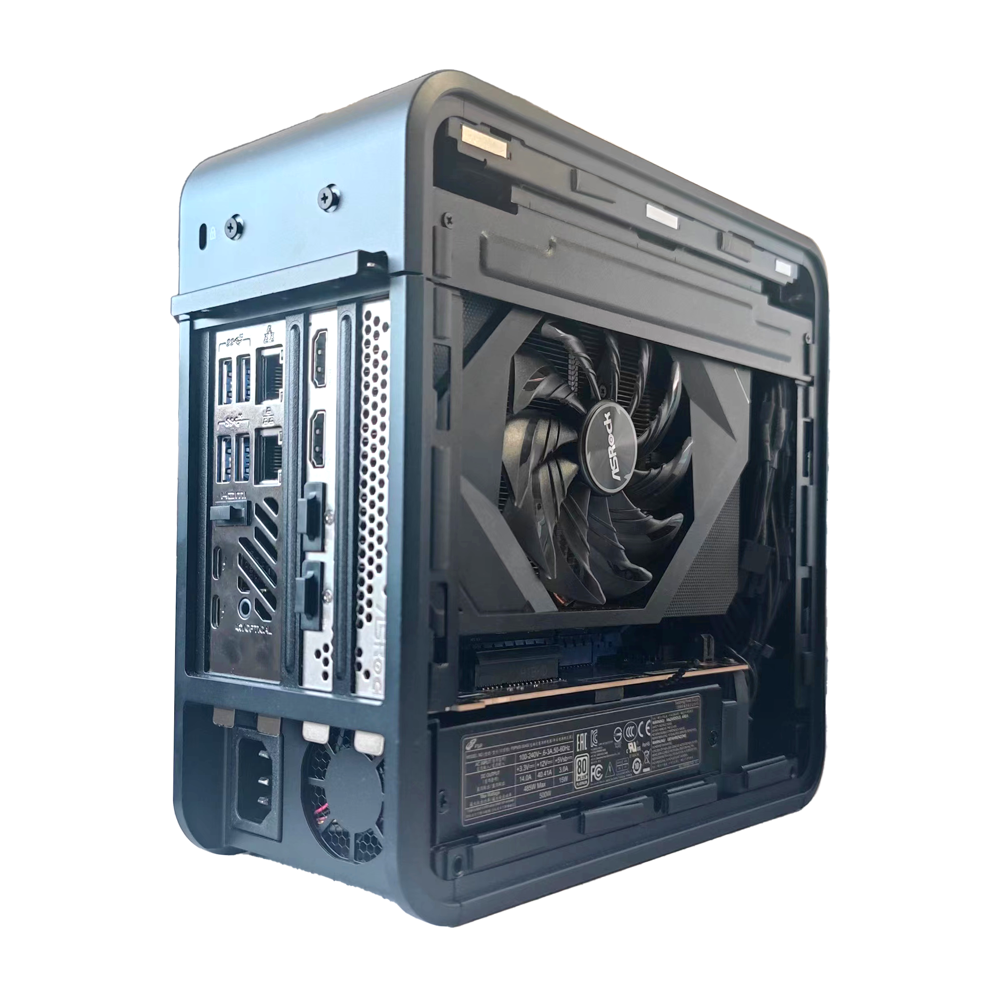