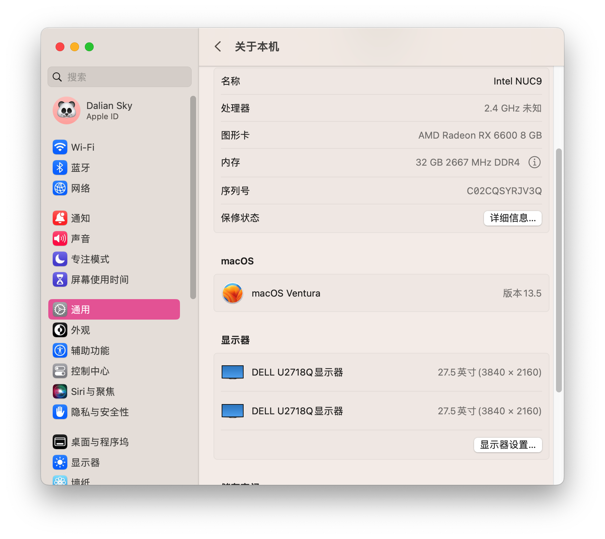

## 电脑配置

|   规格    |                    详细信息                     |
| :-------: | :---------------------------------------------: |
| 电脑型号  | Intel NUC9 `NUC9i5QNX` `NUC9i7QNX` `NUC9i9QNX`  |
| 操作系统  |     macOS `Sonoma` / `Ventura` / `Monterey`     |
|  处理器   |    Intel `i5-9300` / `i7-9750` / `i9-9980HK`    |
|   内存    |             64 GB DDR4 2666-3200MHz             |
| 硬盘1/2/3 |              支持多至三个 m.2 NVMe              |
|   显卡    |            Intel UHD 630 / AMD 独显             |
| 显示接口  |        雷电3 x2 + HDMI 2.0a x1(4K@60Hz)         |
|   声卡    |                USB Audio Device                 |
| 无线网卡  | m.2 NGFF插槽，默认出厂为 `Intel® Wi-Fi 6 AX200` |
| 有线网卡  | Intel® Ethernet Connection`i219-LM` / `i210-AT` |
|  读卡器   |                      SDXC                       |

## 更新日志

- 8-11-2023
  - 更新 `OpenCore` `v0.9.4`
  
- 7-31-2023
  - 第一次提交

## 截屏

